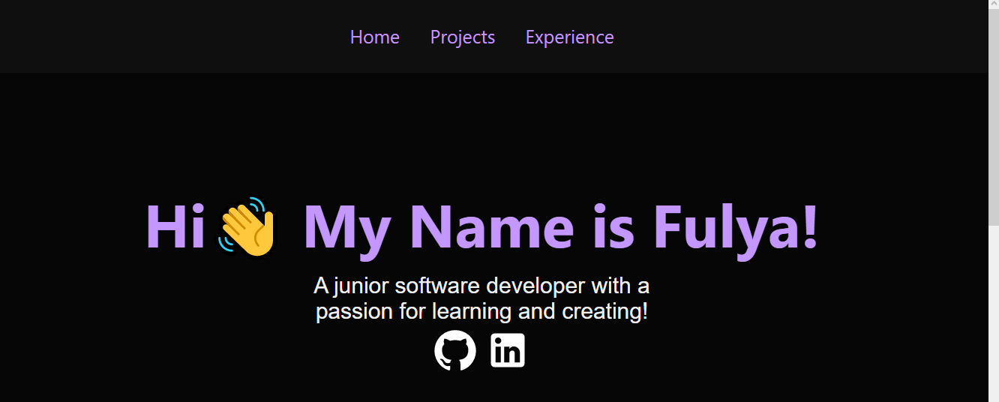

# Portfolio
## Check The Live Website :arrow_right: [Live Website](https://fulyaertay.netlify.app/)

This is my personal portfolio page. It's a multi-page website that shows my personal projects and coding knowledge.I've built this page using ReactJS and Material UI. It's a simple multi-page application that uses server-side rendering, so it loads fast and works on mobile devices as well as desktop computers. You can see the source code of this page here on GitHub.

## 🛠 Use To Built

<p align="left"> 

 


</p>

## 💻 Features

- List My Projects
- Fully Responsive
- Cross Platform
## 🔋 Installation

**1. Clone the Repository**

```
  git clone https://github.com/fulyaertay/react-personal-portfolio
```

**2. Move into the working directory**

```
  cd personal-portfolio
```

**3. Install Dependencies**

```
  npm install
```


**4. Run the App**

```
  npm start
```


## 🚀 About Me

I'm Fulya Ertay.

I am a junior front-end developer oves building full-stack applications & learning new technologies. I I am proficient in HTML, CSS, JavaScript and have working knowledge of ReactJS and Material CSS. I am passionate about creating user-friendly websites and web applications that are easy to use. My goal is to be able to build applications that are fast, responsive, and fun to use.

### 🔗 You Can Follow Me

[](https://www.linkedin.com/in/fulya-ertay-40a593156/)
[](https://github.com/fulyaertay)


